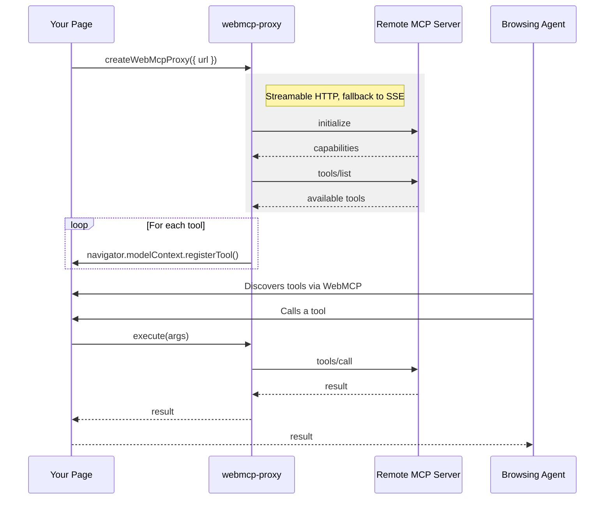

# WebMCP Proxy

Advertise your existing MCP server's tools via [WebMCP](https://github.com/webmachinelearning/webmcp) on your website so any browsing agent can use them.

WebMCP Proxy connects to a remote MCP server, discovers its tools, and registers them with the browser's `navigator.modelContext` API. When a browsing agent invokes a tool, the call is proxied to your MCP server and the result forwarded back.

## Installation

```bash
npm install webmcp-proxy
```

## Usage

### Vanilla JS

```typescript
import { createWebMcpProxy } from "webmcp-proxy";

const proxy = await createWebMcpProxy({
  url: "https://mcp.example.com/mcp",
});

console.log("Registered tools:", proxy.tools);

// Later, to clean up:
await proxy.disconnect();
```

### React

```tsx
import { WebMCPProxy } from "webmcp-proxy/react";

export default function App() {
  return (
    <>
      <WebMCPProxy url="https://mcp.example.com/mcp" />
      {/* Your app content */}
    </>
  );
}
```

### Vue

```vue
<script setup>
import { WebMCPProxy } from "webmcp-proxy/vue";
</script>

<template>
  <WebMCPProxy url="https://mcp.example.com/mcp" />
  <!-- Your app content -->
</template>
```

## Options

All variants accept the same core options:

| Option    | Type                     | Required | Description                                                       |
| --------- | ------------------------ | -------- | ----------------------------------------------------------------- |
| `url`     | `string`                 | Yes      | URL of the remote MCP server                                      |
| `headers` | `Record<string, string>` | No       | Additional headers sent with every request (e.g. `Authorization`) |

## How it works



## Coexistence with page-specific tools

WebMCP Proxy uses `registerTool` / `unregisterTool` rather than `provideContext` to manage tools. This means it **will not** overwrite other tools the page registers on its own — as long as those also use `registerTool`. Proxy tools and page-local tools coexist safely side by side.

## Requirements

- The remote MCP server must support **Streamable HTTP** or **SSE** transport
- The MCP server must allow CORS requests from the browser origin
- The browser must support the [WebMCP API](https://github.com/webmachinelearning/webmcp) (`navigator.modelContext`) — if unavailable, the proxy logs a warning and becomes a no-op

## License

ISC
